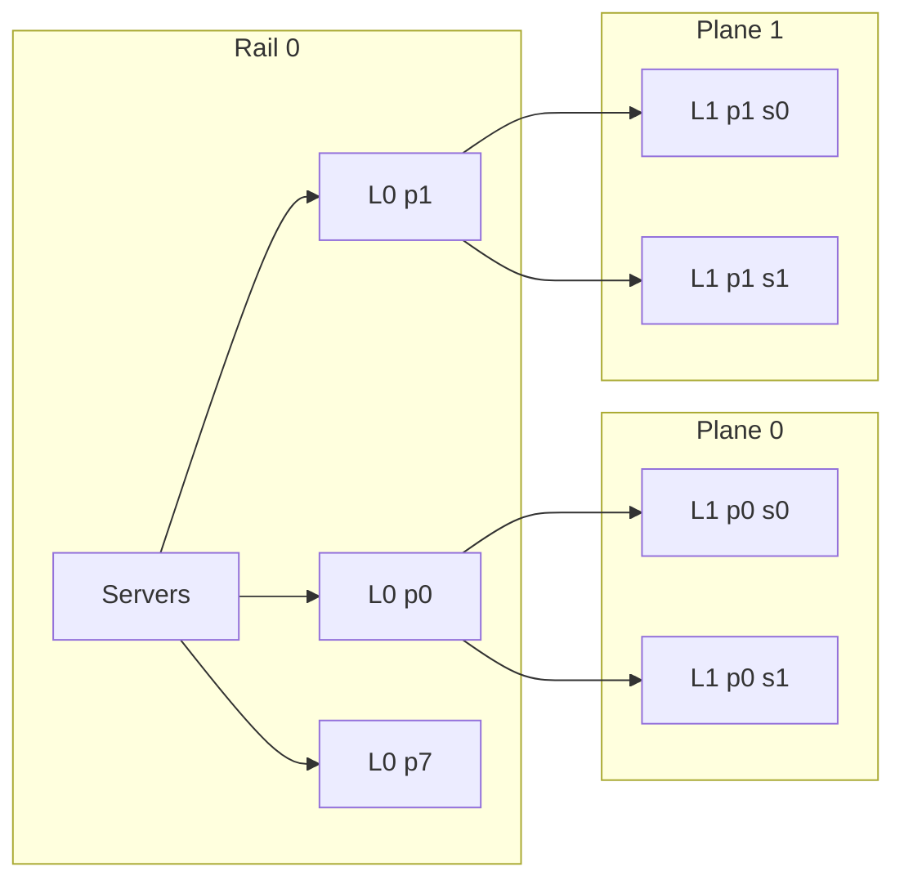

# MpRail 拓扑开发文档

## 1. 目标

MpRail 模拟面向 AI 集群的多平面两层 Leaf-Spine 网络。它不包含光交换路径。拓扑必须同时表达：

- 每张 GPU 的多条独立 rail 链路；
- 同一服务器 GPU 之间的高速 FullMesh；
- 每个 plane 内的两层 L0/L1 packet switching；
- 不同 plane 的物理和队列隔离；
- UEC flow-level ECMP 与 packet spray 两种负载均衡粒度；
- flow-level 模式下一条 flow 固定一个 plane，spray 模式下单流可使用多个 plane。

## 2. 术语

| 名称 | 定义 |
|---|---|
| rank | 一个 GPU-facing 网络端点 |
| server | 一组通过高速 FullMesh 相连的 rank |
| plane | 一套独立的 Leaf-Spine 数据面 |
| rail | 服务器内相同 GPU local index 的集合；8-GPU server 对应 rail 0..7 |
| L0-EPS | plane 内的 Leaf，连接该 rail 上各服务器的 GPU 和同 plane 的 L1-EPS |
| L1-EPS | plane 内的 Spine，连接所有 rail 在该 plane 的 L0-EPS |

关键关系：

```text
server_count = ceil(rank_count / gpus_per_server)
rail_count = gpus_per_server
L0_count = rail_count * plane_count
L1_count = plane_count * l1_eps_per_plane
```

rank 到 server/rail 的映射为：

```text
server_id = rank / gpus_per_server
rail_id = rank % gpus_per_server
```

因此，每台服务器在每条 rail 上各贡献一张 GPU。`plane_count=1`、8-GPU server
时共有 8 条 rail 和 8 台 L0-EPS。

rail 与 plane 是正交维度。plane 表示一套完整、独立的 scale-out fabric：

```text
每个 plane: 8 L0 Leaf <-> 8 L1 Spine
plane 之间: 无交换机链路、无共享 Queue/Pipe
每个 rank: 每个 plane 一个独立 400 Gbps fabric port
```

因此 `plane_count=8` 表示 8 个并行 scale-out 网络，共 64 台 L0 和 64 台
L1；单 rank 聚合带宽为 `8 * 400 = 3200 Gbps`。

## 3. 物理结构



完整结构满足：

```text
L0[rail, plane] <-> every L1[plane, spine]
```

禁止出现：

```text
L0[rail, plane 0] <-> L1[plane 1, *]
L1[plane 0, *] <-> L1[plane 1, *]
L0[rail A, plane] <-> L0[rail B, plane]
```

不同 rail 只能通过同 plane 的 L1-EPS 通信。

## 4. 路径语义

### 4.1 同服务器

```text
src GPU -> server-local FullMesh -> dst GPU
```

不进入 L0/L1。链路速率和延迟单独配置，默认使用远高于单 plane 链路的速率。

### 4.2 不同服务器、同 rail

```text
src GPU -> L0[rail, plane] -> dst GPU
```

不经过 L1-EPS。

### 4.3 不同 rail

```text
src GPU
  -> L0[src_rail, plane]
  -> L1[plane, selected_spine]
  -> L0[dst_rail, plane]
  -> dst GPU
```

L1-EPS 只能在当前 plane 内选择。L0/L1 都安装普通多下一跳 FIB。

### 4.4 三种路由与负载均衡策略

`flow-ecmp`、`oblivious-spray` 和 `ecmp-rr` 是本文对完整行为的逻辑命名，不是当前可以直接传给 `-load_balancing_algo` 的字符串。当前 CLI 仍由 `-strat` 和 `-load_balancing_algo` 组合表达。

| 逻辑策略 | 当前 CLI 组合 | Host/NIC 的 plane 选择 | UEC `pathid` | L0/L1 下一跳 |
|---|---|---|---|---|
| `flow-ecmp` | `-strat ecmp_host -load_balancing_algo ecmp` | 一条 flow 固定一个 preferred plane | 流内固定 | `hash(flow_id, pathid, switch_salt)` |
| `oblivious-spray` | `-strat ecmp_host -load_balancing_algo oblivious` | NIC 按可用端口逐包调度，可使用多个 plane | 逐包轮换 | `hash(flow_id, pathid, switch_salt)` |
| `ecmp-rr` | `-strat ecmp_rr -load_balancing_algo oblivious` | NIC 按可用端口逐包调度，可使用多个 plane | entropy 空间被强制为 1，不承担选路 | 数据包由每台交换机的本地计数器逐包 Round-Robin；小控制包仍使用 hash |

对应的数据包处理过程：

```text
flow-ecmp:
  flow -> fixed plane -> fixed pathid -> L0/L1 ECMP hash

oblivious-spray:
  packet -> available plane port -> new pathid -> L0/L1 ECMP hash

ecmp-rr:
  packet -> available plane port -> L0 local RR -> L1 local RR
```

`oblivious-spray` 和 `ecmp-rr` 都是逐包喷洒，但控制点不同：前者由 UEC 端侧产生逐包 entropy，交换机继续执行 ECMP hash；后者不依赖逐包 entropy，每台交换机独立轮询自己的下一跳。`ecmp-rr` 的交换机计数器由经过该交换机的 flow 共享，不是 per-flow 计数器。

`bitmap`、`reps`、`reps_legacy`、`freezing`、`mixed` 与 `oblivious` 一样使用 packet-spray 数据面，只是 UEC `pathid` 的选择和反馈策略不同。当前 `htsim_uec` 默认使用 `mixed`，因此未显式指定 `-load_balancing_algo` 时，MpRail 默认运行 packet-spray 数据面。

任一 packet 进入某个 plane 后，只能在该 plane 内转发，绝不跨 plane。

## 5. 带宽和端口

统一测试口径：

```text
rank_count = 32
server_count = 4
gpus_per_server = 8
rail_count = 8
plane_count = 1
L0_count = 8
L1_count = 8
endpoint_link_speed = 400 Gb/s
aggregate_rank_bandwidth = 400 Gb/s
```

一般情况下：

```text
aggregate_rank_bandwidth = plane_count * endpoint_link_speed
```

每台 L0-EPS 的端口需求：

```text
down_ports = server_count
up_ports = l1_eps_per_plane * l0_l1_links_per_spine
required_ports = down_ports + up_ports
```

每台 L1-EPS 的下行端口需求：

```text
down_ports = rail_count * l0_l1_links_per_spine
```

是否全截面由以下关系决定：

```text
L0 aggregate uplink bandwidth >= L0 aggregate GPU downlink bandwidth
```

拓扑允许通过 `l1_eps_per_plane` 和链路 bundle 数表达不同 radix 与超卖比例，不把端口数写死在代码里。

## 6. 配置契约

目标 CLI：

```text
-topology mprail
-mprail_planes <N>
-mprail_gpus_per_server <N>
-mprail_l1_eps_per_plane <N>
-mprail_l0_l1_links_per_spine <N>
-linkspeed <Mbps>
-local_linkspeed <Mbps>
-local_latency_ns <ns>
-strat ecmp_host|ecmp_rr
-load_balancing_algo ecmp|oblivious|bitmap|reps|reps_legacy|freezing|mixed
```

首版约束：

- 所有正整数拓扑参数必须大于 0。
- rank 数可以不填满最后一台服务器。
- `local_linkspeed` 独立于 plane 链路速率。
- flow-level ECMP 使用稳定 flow hash 选择 preferred plane。
- packet spray 复用 UEC 多端口 NIC 调度，不增加 MpRail 私有 spray 算法。
- plane 之间物理独立；packet 只能在源 NIC 选择 plane，交换机不能跨 plane 转发。
- 每条物理方向都有独立 Queue 和 Pipe。
- L0/L1 全连接关系由坐标规则完整定义；Queue/Pipe 在某条链路首次被 flow 使用时创建，之后访问同一物理方向和 bundle 时复用。

## 7. 代码边界

新增：

```text
mprail_switch.h/.cpp
mprail_topology.h/.cpp
```

复用：

- `Queue` / `ECNQueue`、`Pipe`、`EventList`；
- UEC 多端口和 preferred NIC port；
- connection matrix 与 DAG 动态 flow 创建；
- 服务器内部高速本地路径的 queue/pipe 结构。

不复用：

- 光交换图与相关路由器；
- 光路径 route plan；
- 跨 plane 特殊下一跳；
- 旧拓扑的 group/pod 语义。

## 8. 开发阶段

1. 实现 MpRailSwitch 的普通 FIB/ECMP。
2. 实现 L0/L1 数量、rail/plane 映射和双向链路缓存。
3. 实现本地、同 rail、跨 rail 三类路径。
4. 接入 `main_uec` 的 `-topology mprail`。
5. 让 DAG 网络 task 通过 MpRailTopology 动态连接端点。
6. 使用 Python 功能测试验证结构、隔离、路由和完成回调。

## 9. 验收标准

- 同服务器流量不进入 L0/L1。
- 同 rail 跨服务器流量只经过一个 L0-EPS。
- 跨 rail 流量严格经过 `L0 -> L1 -> L0`。
- flow-level ECMP 下，一个 flow 的数据方向固定在一个 plane。
- packet spray 下，单流能够使用全部可用 plane，并在每个 plane 内使用多条 ECMP 路径。
- 任一正向或反向 packet 一旦进入某个 plane，就不会跨 plane。
- 任意链路和队列的名称都包含 plane，能够审计 plane 隔离。
- 不出现光交换相关配置、日志或路径选择。
- DAG 的 network/compute barrier在 MpRail 下保持正确。
