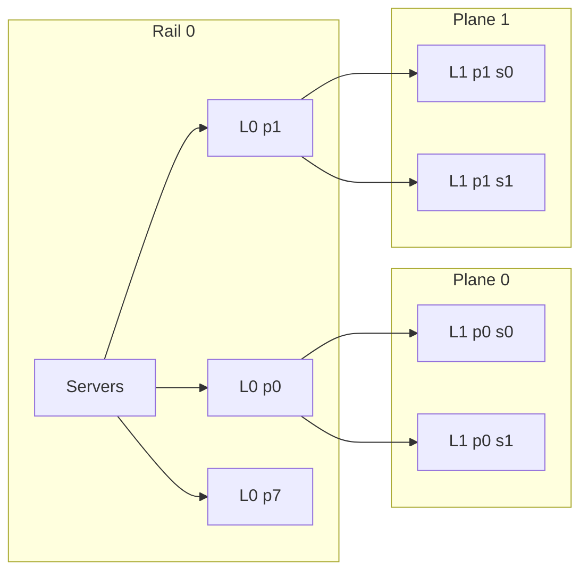

# MpRail 拓扑开发文档

## 1. 目标

MpRail 模拟面向 AI 集群的多平面两层 Leaf-Spine 网络。它不包含光交换路径。拓扑必须同时表达：

- 每张 GPU 的多条独立 rail 链路；
- 同一服务器 GPU 之间的高速 FullMesh；
- 每个 plane 内的两层 L0/L1 packet switching；
- 不同 plane 的物理和队列隔离；
- 同一 flow 的数据方向固定使用一个 plane，同一 QP 集合可分散到多个 plane。

## 2. 术语

| 名称 | 定义 |
|---|---|
| rank | 一个 GPU-facing 网络端点 |
| server | 一组通过高速 FullMesh 相连的 rank |
| plane | 一套独立的 Leaf-Spine 数据面 |
| rail | 一组共享服务器集合、按 plane 各有一台 L0-EPS 的接入域 |
| L0-EPS | plane 内的 Leaf，连接 rail 下的 GPU 和同 plane 的 L1-EPS |
| L1-EPS | plane 内的 Spine，连接所有 rail 在该 plane 的 L0-EPS |

关键关系：

```text
server_count = ceil(rank_count / gpus_per_server)
rail_count = ceil(server_count / servers_per_rail)
L0_count = rail_count * plane_count
L1_count = plane_count * l1_eps_per_plane
```

因此，`plane_count=8` 时，每个 rail 包含 8 台 L0-EPS：每个 plane 一台。

## 3. 物理结构



完整结构满足：

```text
L0[rail, plane] <-> every L1[plane, spine]
```

禁止出现：

```text
L0[rail, plane 0] <-> L1[plane 1, *]
L1[plane 0, *] <-> L1[plane 1, *]
L0[rail A, plane] <-> L0[rail B, plane]
```

不同 rail 只能通过同 plane 的 L1-EPS 通信。

## 4. 路径语义

### 4.1 同服务器

```text
src GPU -> server-local FullMesh -> dst GPU
```

不进入 L0/L1。链路速率和延迟单独配置，默认使用远高于单 plane 链路的速率。

### 4.2 不同服务器、同 rail

```text
src GPU -> L0[rail, plane] -> dst GPU
```

不经过 L1-EPS。

### 4.3 不同 rail

```text
src GPU
  -> L0[src_rail, plane]
  -> L1[plane, selected_spine]
  -> L0[dst_rail, plane]
  -> dst GPU
```

L1-EPS 只能在当前 plane 内选择。选中的 plane 从 UEC source port 得到，选中的 spine 对 flow ID 做稳定 ECMP。UEC 的数据发送端固定使用该 source port；ACK、NACK 等控制包由接收端 NIC 在可用 port 中调度，但任一控制包从入口到出口始终只位于一个 plane，绝不跨 plane 转发。

## 5. 带宽和端口

目标默认口径：

```text
plane_count = 8
endpoint_link_speed = 100 Gb/s per plane
aggregate_rank_bandwidth = 8 * 100 = 800 Gb/s
```

每台 L0-EPS 的端口需求：

```text
down_ports = servers_per_rail * gpus_per_server
up_ports = l1_eps_per_plane * l0_l1_links_per_spine
required_ports = down_ports + up_ports
```

每台 L1-EPS 的下行端口需求：

```text
down_ports = rail_count * l0_l1_links_per_spine
```

是否全截面由以下关系决定：

```text
L0 aggregate uplink bandwidth >= L0 aggregate GPU downlink bandwidth
```

拓扑允许通过 `servers_per_rail`、`l1_eps_per_plane` 和链路 bundle 数表达不同 radix 与超卖比例，不把端口数写死在代码里。

## 6. 配置契约

目标 CLI：

```text
-topology mprail
-mprail_planes <N>
-mprail_gpus_per_server <N>
-mprail_servers_per_rail <N>
-mprail_l1_eps_per_plane <N>
-mprail_l0_l1_links_per_spine <N>
-linkspeed <Mbps>
-local_linkspeed <Mbps>
-local_latency_ns <ns>
```

首版约束：

- 所有正整数拓扑参数必须大于 0。
- rank 数可以不填满最后一台服务器或最后一个 rail。
- `local_linkspeed` 独立于 plane 链路速率。
- plane 选择使用稳定 flow hash；不实现交换机侧跨 plane 负载均衡。
- 每条物理方向都有独立 Queue 和 Pipe。
- L0/L1 全连接关系由坐标规则完整定义；Queue/Pipe 在某条链路首次被 flow 使用时创建，之后访问同一物理方向和 bundle 时复用。

## 7. 代码边界

新增：

```text
mprail_switch.h/.cpp
mprail_topology.h/.cpp
```

复用：

- `Queue` / `ECNQueue`、`Pipe`、`EventList`；
- UEC 多端口和 preferred NIC port；
- connection matrix 与 DAG 动态 flow 创建；
- 服务器内部高速本地路径的 queue/pipe 结构。

不复用：

- 光交换图与相关路由器；
- 光路径 route plan；
- 跨 plane 特殊下一跳；
- 旧拓扑的 group/pod 语义。

## 8. 开发阶段

1. 实现 MpRailSwitch 的普通 FIB/ECMP。
2. 实现 L0/L1 数量、rail/plane 映射和双向链路缓存。
3. 实现本地、同 rail、跨 rail 三类路径。
4. 接入 `main_uec` 的 `-topology mprail`。
5. 让 DAG 网络 task 通过 MpRailTopology 动态连接端点。
6. 使用 Python 功能测试验证结构、隔离、路由和完成回调。

## 9. 验收标准

- 同服务器流量不进入 L0/L1。
- 同 rail 跨服务器流量只经过一个 L0-EPS。
- 跨 rail 流量严格经过 `L0 -> L1 -> L0`。
- 一个 flow 的数据方向固定在一个 plane；任一正向或反向 packet 都不会跨 plane。
- 任意链路和队列的名称都包含 plane，能够审计 plane 隔离。
- 不出现光交换相关配置、日志或路径选择。
- DAG 的 network/compute stage 屏障在 MpRail 下保持正确。
